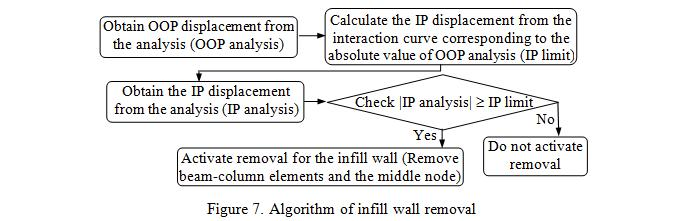

.. include:: sub.txt

   
==============================
Collapse Recorder command
==============================

.. function:: recorder('Collapse','-node',nodeTag,'-file_infill',fileNameinf,'-checknodes', nTagbotn, nTagmidn, nTagtopn, '-global_gravaxis', globgrav, '-secondary', '-eles', *eleTags, '-eleRage', start, end, '-region', regionTag, '-time', '-dT', dT, '-file', fileName, '-mass', *massValues, '-g', gAcc, gDir, gPat, '-section', *secTags, '-crit', critType, critValue)
   :noindex:

   A progressive collapse algorithm is developed by Talaat, M and Mosalam, K.M. in [1-3] and is implemented in
   OpenSeesPy interpreter. The different applications of said algorithm are exemplified in references [4-7].
   This algorithm is developed using element removal which relies on the dynamic equilibrium and the subsequent
   transient change in the system kinematics. The theoretical background of the routine is detailed in the references
   mentioned herein.

   ===========================   =====================================================================================================================================================
   ``nodeTag`` |int|             node tag
   ``fileNameinf`` |str|         is the file used to input the displacement interaction curve. Two columns of data are input in this file where only positive values are input. First column is the OOP displacement in ascending order and second column is the corresponding IP displacement. Full interaction should be defined. In other words, first value of OOP displacement and last value of IP displacement should be zero.
   ``fileName`` |str|            is the file name for element removal log. Only one log file is constructed for all collapse recorder commands (i.e. for all removals). The first file name input to a collapse recorder command is used and any subsequent file names are ignored.
   ``globgrav`` |float|          is the global axis of the model in the direction of gravity. 1, 2 and 3 should be input for X, Y and Z axes, respectively.
   ``critType`` |lists|          criterial type
   
                                 * ``'INFILLWALL'`` no value required
                                 * ``'minStrain'`` value required
                                 * ``'maxStrain'`` value required
                                 * ``'axialDI'`` value required
                                 * ``'flexureDI'`` value required
                                 * ``'axialLS'``  value required
				 * ``'shearLS'``  value required
   ===========================   =====================================================================================================================================================

The progressive collapse algorithm is thus implemented within OpenSeesPy for an automatic removal of
elements which have “numerically” collapse during an ongoing dynamic simulation. Main elements of the
progressive collapse routine are illustrated in Figures 1 and 2. The implementation is supported in Python as a
relatively new OpenSees module. Following each converged step of the dynamic analysis, the algorithm is called
to check each element respectively for possible violation given a user-defined removal criteria. The routine calls
for the activation of the element removal sequence before accessing the main analysis module on the subsequent
analysis step. Activation of the element removal algorithm includes updating nodal masses, checking if the
removal of the collapsed element results in leaving behind dangling nodes or floating elements, which must be
removed as well and removing all associated element and nodal forces, imposed displacements, and constraints.

.. image:: ../_static/flowchart.png

 
Furthermore, the aforementioned infill wall element and its removal criteria are defined for force- and
displacement-based distributed plasticity fiber elements and lumped plasticity beam–column elements with fiber-
discretized plastic hinges. Current version of OpenSeesPy considers only the removal of the infill wall model
described
in
(https://opensees.berkeley.edu/wiki/index.php/Infill_Wall_Model_and_Element_Removal#New_Command_in_
OpenSees_Interpreter).
Implementation of the removal of the elements representing the aforementioned infill wall analytical model in the
progressive collapse algorithm is performed through defining a removal criterion for the beam-column elements
of this model. This criterion is based on the interaction between the in-plane (IP) and out-of-plane (OOP)
displacements. IP displacement is the relative horizontal displacement between the top and bottom nodes of the
diagonal element. OOP displacement is that of the middle node (where the OOP mass is attached) with respectto the chord which connects the top and bottom nodes. The user is free to choose any interaction relationship
between IP and OOP displacements. In the example highlighted above, the interaction between in-plane and
out-of-plane is taken into consideration with regards to the displacement interaction between the two
mechanisms, where the IP and OOP displacement capacities are obtained using the FEMA 356 formulation for
collapse prevention level. During the nonlinear time history simulation, when the mentioned combination of
displacements from the analysis exceeds the interaction curve, the two beam-column elements and the middle
node, representing the unreinforced masonry infill wall, are removed.

For the example illustrated in the next Figure, the existing Python command and its arguments in the OpenSeesPy interpreter
with respect to the infill wall removal is described such that:

.. code-block:: python

   recorder('Collapse', '-ele', ele1, '-time', '-crit', 'INFILLWALL', '-file', filename, '-file_infill', filenameinf, '-global_gravaxis, globgrav, '-checknodes', nodebot, nodemid, nodetop)

   recorder('Collapse', '-ele', ele2, '-time', '-crit', 'INFILLWALL', '-file', filename, '-file_infill', filenameinf, '-global_gravaxis, globgrav, '-checknodes', nodebot, nodemid, nodetop)

   recorder('Collapse', '-ele', ele1, ele2, '-node', nodemid)

.. image:: ../_static/collapserecorder.png

.. note::

   it might seem that node inputs are unnecessary. However, when there are shear springs in the model, nodetop and nodebot should be the nodes of the springs which connect to the beams, since the shear spring deformation contributes to the IP displacement of the infill wall. These nodes are not the nodes of the diagonal element. Therefore, it is necessary to input these nodes.

References

1. Talaat, M. and Mosalam, K.M. (2008), “Computational Modeling of Progressive Collapse in Reinforced
Concrete Frame Structures”, Pacific Earthquake Engineering Research Center, PEER 2007/10.
2. Talaat, M. and Mosalam, K.M. (2009), “Modeling Progressive Collapse in Reinforced Concrete Buildings
Using Direct Element Removal”, Earthquake Engineering and Structural Dynamics, 38(5): 609-634.
3. Talaat, M. and Mosalam, K.M. (2009), Chapter20: How to Simulate Column Collapse and Removal in As-
built and Retrofitted Building Structures?, in Seismic Risk Assessment and Retrofitting - with special emphasis
on existing low-rise structures, Ilki, A, Karadogan, F, Pala, S & Yuksel, E (Eds), ISBN 978-90-481-2680-4,
Springer.
4. Talaat, M. and Mosalam, K.M. (2006), “Progressive Collapse Modeling of Reinforced Concrete Framed
Structures Containing Masonry Infill Walls”, Proceedings of the 2nd NEES/E-Defense Workshop on Collapse
Simulation of Reinforced Concrete Building Structures, Kobe, Japan.
5. Talaat, M. and Mosalam, K.M. (2007), “Towards Modeling Progressive Collapse in Reinforced Concrete
Buildings”, Proceedings of SEI-ASCE 2007 Structures Congress, Long Beach, California, USA.
6. Mosalam, K.M., Talaat, M., and Park, S. (2008), “Modeling Progressive Collapse in Reinforced Concrete
Framed Structures”, Proceedings of the 14th World Conference on Earthquake Engineering, Beijing, China,
October 12-17, Paper S15-018.
7. Mosalam, K.M., Park, S., Günay, M.S. (2009), “Evaluation of an Element Removal Algorithm for Reinforced
Concrete Structures Using Shake Table Experiments,” Proceedings of the 2nd International Conference on
Computational Methods in structural Dynamics and Earthquake Engineering (COMPDYN 2009), Island of
Rhodes, Greece, June 22-24.
