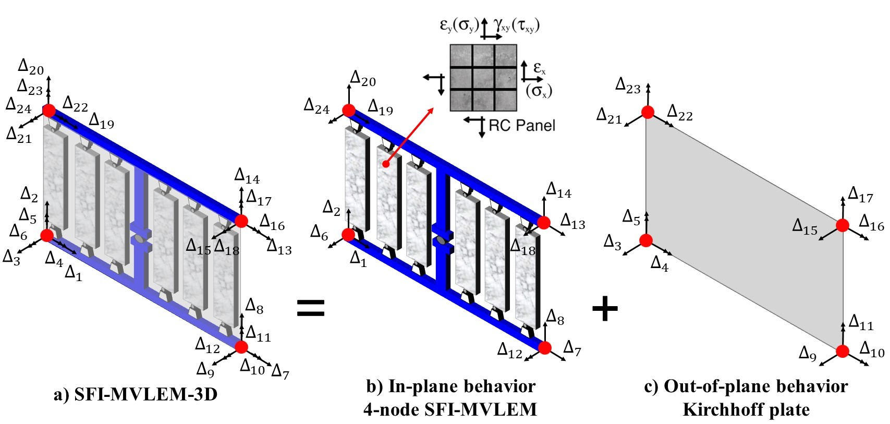

.. include:: sub.txt

===========================================================
SFI_MVLEM_3D - 3-D Shear-Flexure-Interaction Element for RC Walls 
===========================================================

| Developed and implemented by: 
| `Kristijan Kolozvari <mailto:kkolozvari@fullerton.edu>`_ (CSU Fullerton)
| Kamiar Kalbasi (CSU Fullerton)
| Kutay Orakcal (Bogazici University)
| John Wallace (UCLA)

The SFI-MVLEM-3D model (Figure 1a) is a three-dimensional four-node element with 24 DOFs that incorporates axial-flexural-shear interaction and can be used for nonlinear analysis of non-rectangular reinforced concrete walls subjected to multidirectional loading. The SFI-MVLEM-3D model is an extension of the two-dimensional, two-node Shear-Flexure-Interaction Multiple-Vertical-Line-Element-Model (`SFI-MVLEM <https://opensees.berkeley.edu/wiki/index.php/SFI_MVLEM_-_Cyclic_Shear-Flexure_Interaction_Model_for_RC_Walls>`_). The baseline SFI-MVLEM, which is essentially a line element for rectangular walls subjected to in-plane loading, is extended in this study to a three-dimensional model formulation by applying geometric transformation of the element degrees of freedom that converted it into a four-node element formulation (Figure 1b), as well as by incorporating linear elastic out-of-plane behavior based on the Kirchhoff plate theory (Figure 1c). The in-plane and the out-of-plane element behaviors are uncoupled in the present model.

This element shall be used in Domain defined with **-ndm 3 -ndf 6**.

	**Figure 1: SFI_MVLEM_3D Element Formulation**
	
.. function:: element('SFI_MVLEM_3D', eleTag,*eleNodes,m, '-thick', *thicks,'-width',*widths,'-mat',*matTags,<'-CoR',c>,<'-ThickMod',tMod>,<'-Poisson',Nu>,<'-Density',Dens>)
   :noindex:

   ===================================   ===========================================================================
   ``eleTag`` |int|                      unique element object tag
   ``eleNodes`` |listi|                  a list of four element nodes defined in the counter-clockwise direction
   ``m`` |int|                           number of element uniaxial fibers
   ``thicks`` |listf|                    a list of ``m`` macro-fiber thicknesses
   ``widths`` |listf|                    a list of ``m`` macro-fiber widths
   ``matTags`` |listi|             		 a list of ``m`` material tags corresponding to nDmaterial FSAM
   
   ``c`` |float|                         location of center of rotation from the base (optional; default = 0.4 (recommended))
   ``tMod`` |float|                      thickness multiplier (optional; default = 0.63 equivalent to 0.25Ig for out-of-plane bending)
   ``Nu`` |float|                        Poisson ratio for out-of-plane bending (optional; default = 0.25)
   ``Dens`` |float|                      density (optional; default = 0.0)
   ===================================   ===========================================================================

.. seealso::

   More information available `HERE <https://kkolozvari.github.io/SFI-MVLEM-3D/>`_ and in the following reference:
   
   K. Kolozvari, K. Kalbasi, K. Orakcal & J. W. Wallace, "Three-Dimensional Shear-Flexure Interaction Model for Analysis of Non-Planar Reinforced Concrete Walls", Journal of Building Engineering, `Volume 44, December 2021, 102946 <https://www.sciencedirect.com/science/article/pii/S2352710221008044?via%3Dihub>`_.
